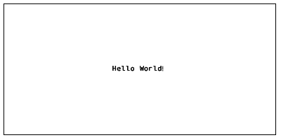
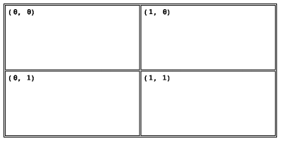
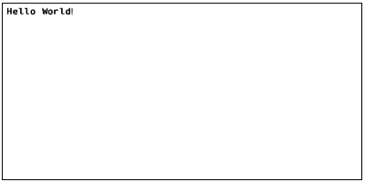
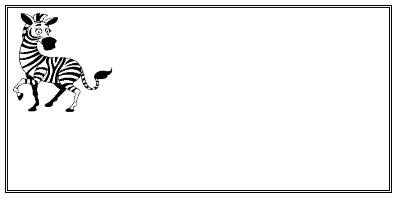

# JSZPL
Generate ZPL II from JavaScript classes.
`^FX No more Printer Commands!`

```js
var text = new Text();
label.content.push(text);
text.text = 'Hello World!';
text.fontFamily = new FontFamily(FontFamilyName.D);
text.verticalAlignment = new Alignment(AlignmentValue.Center);
text.horizontalAlignment = new Alignment(AlignmentValue.Center);

var zpl = label.generateZPL();
//^XA
//^FO10,205^AD,N,,
//^FB780,1,0,C,0
//^FDHello World!^FS
//^XZ
```



## Table of Contents
- [Installation](#installation)
- Property Types
  - [Size](#size)
  - [PrintDensity](#printdensity)
  - [FontFamily](#fontfamily)
  - [Alignment](#alignment)
  - [Spacing](#spacing)
  - [GridPosition](#gridposition)
  - [BarcodeType](#barcodetype)
  - [Content](#content)
  - [GraphicData](#graphicdata)
- Elements
  - [Label](#label)
  - [Text](#text)
  - [Grid](#grid)
  - [Box](#grid)
  - [Circle](#circle)
  - [Barcode](#barcode)
  - [Graphic](#graphic)
- [Known Issues](#known-issues)
- [Roadmap](#roadmap)

## Installation

In a browser:

```html
<script src="zpl-fonts.js"></script>
<script src="jszpl.js"></script>

<script type="text/javascript">
  var label = new Label();
  label.printDensity = new PrintDensity(PrintDensityName['8dpmm']);
  label.width = 100;
  label.height = 50;
  label.padding = new Spacing(10);

  var text = new Text();
  label.content.push(text);
  text.fontFamily = new FontFamily(FontFamilyName.D);
  text.text = 'Hello World!';

  var zpl = label.generateZPL();
  //^XA
  //^FO10,10^AD,N,,
  //^FB780,1,0,L,0
  //^FDHello World!^FS
  //^XZ
</script>
```

Using npm:

```sh
$ npm i jszpl
```

In Node.js:

```js
var jszpl = require('jszpl');

var label = new jszpl.Label();
label.printDensity = new jszpl.PrintDensity(jszpl.PrintDensityName['8dpmm']);
label.width = 100;
label.height = 50;
label.padding = new jszpl.Spacing(10);

var text = new jszpl.Text();
label.content.push(text);
text.fontFamily = new jszpl.FontFamily(jszpl.FontFamilyName.D);
text.text = 'Hello World!';

var zpl = label.generateZPL();
//^XA
//^FO10,10^AD,N,,
//^FB780,1,0,L,0
//^FDHello World!^FS
//^XZ
```

## Property Types

Most of the properties are defined in their own object types, which provides the ability to view the property constructor name, instead of just `String`, `Number`, or `Object`.

#### Size

Size is used by width, height, column definition, and row definition properties. Size takes a number and SizeType as constructor parameters.

SizeType has the following definition:
```js
var SizeType = {
  Absolute : 0, // exact size
  Fraction : 1, // size as fraction of parent
  Relative : 2, // size together with siblings as part of parent
}
```

Usage examples:
```js
grid.width = new SizeType(250, SizeType.Absolute);
grid.columns.push(new SizeType(1, SizeType.Relative));
```

Alternatively, if only a number is applied to the width or height properties,
or a single value supplied to the constructor, the value is interpreted as being an absolute value. 

The lines in the example below have the same effect:

```js
grid.width = 250;
grid.width = new Size(250);
grid.width = new Size(250, SizeType.Absolute);
```

Using SizeType.Fraction requires input number to be smaller than 1.

#### PrintDensity

PrintDensity is only used by the Label element. It denotes the dot density of the output label. The Label element is also the only element whose width and height properties are measured in millimeters rather than dots.

PrintDensityName has the following definition:

```js
var PrintDensityName = {
  '6dpmm' : 6,
  '8dpmm' : 8,
  '12dpmm' : 12,
  '24dpmm' : 24,
}
``` 

Usage example:

```js
var label = new Label();
label.printDensity = new PrintDensity(PrintDensityName['8dpmm']);
```

#### FontFamily

FontFamily is only used by the Text element. It denotes the font matrix to use for the element text. Only fonts A-F are implemented.

FontFamilyName has the following definition:

```js
var FontFamilyName = {
  A : 'A',
  B : 'B',
  D : 'D',
  E : 'E',
  F : 'F',
  //G : 'G',
  //H : 'H',
  //P : 'P',
  //Q : 'Q',
  //U : 'U',
  //V : 'V',
}
```

Font names G to V are not implemented. Usage will result in an error.

Usage example:

```js
var text = new Text();
text.fontFamily = new FontFamily(FontFamilyName.D);
```

#### Alignment

Alignment is only used by the the Text element. It is applied to the horizontalAlignment and verticalAlignment properties to align the text within its parent container.

AlignmentValue has the following definition:

```js
var AlignmentValue = {
  Start: 'Start',
  Center: 'Center',
  End: 'End',
}
```

Usage example:

```js
var text = new Text();
text.verticalAlignment = new Alignment(AlignmentValue.Center);
text.horizontalAlignment = new Alignment(AlignmentValue.Center);
```

#### Spacing

Spacing is used by margin and padding properites. It contains sub-properties for left, top, right, and bottom numeric values.

Spacing constructor supports 0, 1, 2, and 4 parameters.

Usage examples:

```js
// 0 parameters
// default values of 0 for all sides
label.padding = new Spacing(); 

// 1 parameter
// 10 for all sides
label.padding = new Spacing(10); 

// 2 parameters
// 10 for left and right, 20 for top and bottom
label.padding = new Spacing(10, 20); 

// 4 parameters
// 10 left, 20 top, 30 right, 40 bottom
label.padding = new Spacing(10, 20, 30, 40);
```

#### GridPosition

GridPosition is used by all elements except for the Label. GridPosition has a column and row property which places the component in a specific column and row if its direct parent element is a Grid.

Usage example:

```js
var grid = new Grid();
label.content.push(grid);
grid.columns.push(new Size(1, SizeType.Relative));
grid.columns.push(new Size(1, SizeType.Relative));
grid.rows.push(new Size(1, SizeType.Relative));
grid.rows.push(new Size(1, SizeType.Relative));
grid.columnSpacing = 2;
grid.rowSpacing = 2;
grid.border = 2;
grid.padding = new Spacing(10);

var text00 = new Text();
grid.content.push(text00);
text00.text = '(0, 0)';
text00.fontFamily = new FontFamily(FontFamilyName.D);

var text10 = new Text();
grid.content.push(text10);
text10.text = '(1, 0)';
text10.fontFamily = new FontFamily(FontFamilyName.D);
text10.grid.column = 1;

var text01 = new Text();
grid.content.push(text01);
text01.text = '(0, 1)';
text01.fontFamily = new FontFamily(FontFamilyName.D);
text01.grid.row = 1;

var text11 = new Text();
grid.content.push(text11);
text11.text = '(1, 1)';
text11.fontFamily = new FontFamily(FontFamilyName.D);
text11.grid.column = 1;
text11.grid.row = 1;
```



#### BarcodeType

BarcodeType is only used by the Barcode element. It denotes the barcode type to use.

BarcodeTypeName has the following definition:

```js
var BarcodeTypeName = {
  Code11: 'Code11',
  Interleaved25: 'Interleaved25',
  Code39: 'Code39',
  PlanetCode: 'PlanetCode',
  PDF417: 'PDF417',
  EAN8: 'EAN8',
  UPCE: 'UPCE',
  Code93: 'Code93',
  Code128: 'Code128',
  EAN13: 'EAN13',
  Industrial25: 'Industrial25',
  Standard25: 'Standard25',
  ANSICodabar: 'ANSICodabar',
  Logmars: 'Logmars',
  MSI: 'MSI',
  Plessey: 'Plessey',
  QRCode: 'QRCode',
  DataMatrix: 'DataMatrix',
  PostNet: 'PostNet'
}
```

Usage example:

```js
var barcode = new Barcode();
barcode.type = new BarcodeType(BarcodeTypeName.Code11);
```

#### Content

Content is an array property on elements which can contain children. Child elements are positioned relative to their parent, if the parent element is moved, all child elements will also be moved.

Container elements:
- Label
- Box
- Circle
- Grid

Usage example:

```js
var label = new Label();
var text = new Text();
label.content.push(text);
```

#### GraphicData

GraphicData is used by Graphic to display image data. GraphicData.data contains the original image binary data. GraphicData.width and GraphicData.height contains the original image width and height.

GraphicData has the following definition:

```js
class GraphicData {
  constructor(width, height, data) {
    this.data = data || [];
    this.width = width || 0;
    this.height = height || 0;
  }
}
```

An image processor must be defined for each platform. The purpose of an image processor is to convert an image into a black and white array representation (consisting of 1s and 0s).
Below is an example of a processor for a web browser:

```js
var graphic = new Graphic();

var image = new Image();
image.onload = function() {
  var canvas = document.createElement('canvas');
  canvas.width = image.width;
  canvas.height = image.height;

  var context = canvas.getContext('2d');
  context.drawImage(image, 0, 0);

  var imageData = context.getImageData(0, 0, canvas.width, canvas.height);

  var index = 0;
  var imageBits = [];

  for (var y = 0; y < imageData.height; y++) {
    for (var x = 0; x < imageData.width; x++) {

      var red = imageData.data[index++];
      var green = imageData.data[index++];
      var blue = imageData.data[index++];
      var opacity = imageData.data[index++];

      var value = 0;

      if (opacity != 0) {
        value = (((red + green + blue) / 3) < 180) ? 1 : 0;
      }

      imageBits.push(value);
    }
  }
  graphic.data = new GraphicData(image.width, image.height, imageBits));
};
image.src = data;
```

## Elements

#### Label

Label is the base container element within which other elements can be placed.

##### Properties

| Property | Type | Description |
| :-- | :-- | :-- |
| printDensity | [PrintDensity](#printdensity) | Dot density of the label (6 dpmm, 8 dpmm, 12 dpmm, 24 dpmm) |
| width | Number | Sets the width of the label based on printDensity.value |
| height | Number | Sets the height of the label based on printDensity.value |
| padding | [Spacing](#spacing) | Sets the padding of the label element, makes child elements consume less space |
| content | Array | Child elements |

##### Usage example:

The example creates a 100mm x 50mm label with a print density of 8 dpmm.
The label has a padding of 10 dots and contains a text field.

```js
var label = new Label();
label.printDensity = new PrintDensity(PrintDensityName['8dpmm']);
label.width = 100;
label.height = 50;
label.padding = new Spacing(10);

var text = new Text();
label.content.push(text);
text.fontFamily = new FontFamily(FontFamilyName.D);
text.text = 'Hello World!';

var zpl = label.generateZPL();
//^XA
//^FO10,10^AD,N,,
//^FB780,1,0,L,0
//^FDHello World!^FS
//^XZ
```



#### Text

Text displays characters on the label.

##### Properties

| Property | Type | Description |
| :-- | :-- | :-- |
| fontFamily | [FontFamily](#fontfamily) | Font family matrix to use |
| verticalAlignment | [Alignment](#alignment) | Vertical alignment, default AlignmentValue.Start |
| horizontalAlignment | [Alignment](#alignment) | Horizontal alignment, default AlignmentValue.Start |
| fixed | Boolean | If set, positions the element with relation to the label rather than parent |
| invert | Boolean | Invert color values |
| grid | [GridPosition](#gridposition) | Configure element placement within grid |
| margin | [Spacing](#spacing) | Configure space around element |
| width | [Size](#size) / Number | Sets the width of the element, uses parent size if omitted |
| height | [Size](#size) / Number | Sets the height of the element, uses parent size if omitted |
| left | [Size](#size) / Number | Sets the left offset of the element |
| top | [Size](#size) / Number | Sets the top offset of the element |
| text | String | Sets the text of the element |

#### Box

Displays a rectangular shape.

##### Properties

| Property | Type | Description |
| :-- | :-- | :-- |
| fill | Boolean | Fill the shape content with a solid color |
| cornerRadius | Number | Shape corner radius |
| fixed | Boolean | If set, positions the element with relation to the label rather than parent |
| invert | Boolean | Invert color values |
| grid | [GridPosition](#gridposition) | Configure element placement within grid |
| margin | [Spacing](#spacing) | Configure space around element |
| padding | [Spacing](#spacing) | Configure space inside element |
| width | [Size](#size) / Number | Sets the width of the element, uses parent size if omitted |
| height | [Size](#size) / Number | Sets the height of the element, uses parent size if omitted |
| left | [Size](#size) / Number | Sets the left offset of the element |
| top | [Size](#size) / Number | Sets the top offset of the element |
| border | Number | Sets the border thickness of the element, ignored if fill is set |
| content | Array | Child elements |

#### Circle

Displays a circular shape.

##### Properties

| Property | Type | Description |
| :-- | :-- | :-- |
| fill | Boolean | Fill the shape content with a solid color |
| fixed | Boolean | If set, positions the element with relation to the label rather than parent |
| invert | Boolean | Invert color values |
| grid | [GridPosition](#gridposition) | Configure element placement within grid |
| margin | [Spacing](#spacing) | Configure space around element |
| padding | [Spacing](#spacing) | Configure space inside element |
| width | [Size](#size) / Number | Sets the width of the element, uses parent size if omitted |
| height | [Size](#size) / Number | Sets the height of the element, uses parent size if omitted |
| left | [Size](#size) / Number | Sets the left offset of the element |
| top | [Size](#size) / Number | Sets the top offset of the element |
| border | Number | Sets the border thickness of the element, ignored if fill is set |
| content | Array | Child elements |

#### Grid

Displays a grid.

##### Properties

| Property | Type | Description |
| :-- | :-- | :-- |
| fixed | Boolean | If set, positions the element with relation to the label rather than parent |
| invert | Boolean | Invert color values |
| grid | [GridPosition](#gridposition) | Configure element placement within grid |
| margin | [Spacing](#spacing) | Configure space around element |
| padding | [Spacing](#spacing) | Configure space inside element cells |
| columnSpacing | Number | Horizontal space between cells |
| rowSpacing | Number | Vertical space between cells |
| width | [Size](#size) / Number | Sets the width of the element, uses parent size if omitted |
| height | [Size](#size) / Number | Sets the height of the element, uses parent size if omitted |
| left | [Size](#size) / Number | Sets the left offset of the element |
| top | [Size](#size) / Number | Sets the top offset of the element |
| border | Number | Sets the border thickness of the element cells |
| columns | Array<[Size](#size)> | Element column definitions |
| rows | Array<[Size](#size)> | Element row definitions |
| content | Array | Child elements |

#### Barcode

Displays a barcode.

##### Properties

| Property | Type | Description |
| :-- | :-- | :-- |
| fixed | Boolean | If set, positions the element with relation to the label rather than parent |
| grid | [GridPosition](#gridposition) | Configure element placement within grid |
| margin | [Spacing](#spacing) | Configure space around element |
| width | [Size](#size) / Number| Sets the width of the element, uses parent size if omitted |
| height | [Size](#size) / Number | Sets the height of the element, uses parent size if omitted |
| left | [Size](#size) / Number | Sets the left offset of the element |
| top | [Size](#size) / Number | Sets the top offset of the element |
| type | [BarcodeType](#barcodetype) | Sets the barcode type to use |
| data | String | Text to encode into barcode |
| maxLength | Number | Additional parameter to use for sizing of 2D barcodes. Populate with expected maximum data length. |

#### Graphic

Displays an image on the label. 

##### Properties

| Property | Type | Description |
| :-- | :-- | :-- |
| fixed | Boolean | If set, positions the element with relation to the label rather than parent |
| invert | Boolean | Invert color values |
| grid | [GridPosition](#gridposition) | Configure element placement within grid |
| margin | [Spacing](#spacing) | Configure space around element |
| width | [Size](#size) / Number | Sets the width of the element, uses parent size if omitted |
| height | [Size](#size) / Number | Sets the height of the element, uses parent size if omitted |
| left | [Size](#size) / Number | Sets the left offset of the element |
| top | [Size](#size) / Number | Sets the top offset of the element |
| border | Number | Sets the border thickness around the image |
| data | [GraphicData](#graphicdata) | Image data |

Example of image:



## Known Issues

| Feature | Notes |
| :-- | :-- |
| Invert | Not implemented correctly by all controls | 
| Grid Columnspan | Pending implementation |
| Grid Rowspan | Pending implementation |
| Rotation | Pending implemented |
| Fonts | Fonts A-F are implemented, G-V not implemeneted |
| DataMatrix barcode | Sometimes not displayed, properties result in invalid sizing |
| Text line breaks | Text element does not support line breaks |

## Roadmap

| Feature | Notes |
| :-- | :-- |
| Line | Implement line element |
| Stack | Stack elements based on set size or minimum size. Direction horizontal or vertical. |
| Barcode auto sizing | Automatically size 2D barcodes based on data lentgh to fit available space. |
