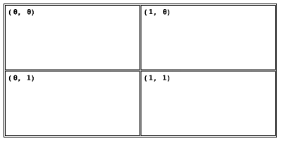
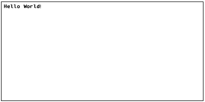
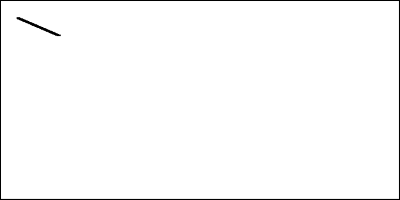
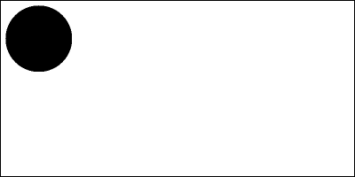
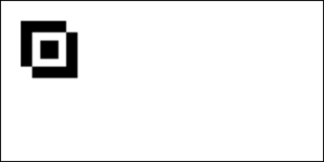

# JSZPL

    [](https://www.paypal.com/donate/?hosted_button_id=BVBKNU8NHN2UN)

Generate ZPL II from JavaScript
`^FX No more Printer Commands!`

```ts
const text = new Text();
label.content.push(text);
text.text = 'Hello World!';
text.fontFamily = FontFamily.D;
text.verticalAlignment = Alignment.Center;
text.horizontalAlignment = Alignment.Center;

const zpl = label.generateZPL();
//^XA
//^FO10,190^AD,,,
//^FB780,1000,0,C,0
//^FDHello World!\&^FS
//^XZ
```


> [!WARNING]
>## Migration Guide: v1 → v2
>
>v2 rewrites the entire library in TypeScript. Most usage patterns remain the same, but the following changes are required.
>
>### Fixed Positioning
>
>Fixed positioning values (`left`, `top`) for elements were incorrectly doubled in v1. Setting `element.left = 150` with `fixed = true` now correctly outputs `^FO150`. If you relied on the old behavior, set `useLegacyPositioning = true` on the `Label` object:
>
>```ts
>const label = new Label();
>label.useLegacyPositioning = true;
>```
>
>To migrate without the flag, double your fixed `left` and `top` values to match the old output positions.

---

## Table of Contents
- [Migration Guide](#migration-guide-v1--v2)
- [Installation](#installation)
- Property Types
  - [Size](#size)
  - [PrintDensity](#printdensity)
  - [FontFamily](#fontfamily)
  - [Alignment](#alignment)
  - [Spacing](#spacing)
  - [GridPosition](#gridposition)
  - [BarcodeType](#barcodetype)
  - [Content](#content)
  - [GraphicData](#graphicdata)
- Elements
  - [Label](#label)
  - [Text](#text)
  - [Grid](#grid)
  - [Box](#grid)
  - [Line](#Line)
  - [Circle](#circle)
  - [Barcode](#barcode)
  - [Graphic](#graphic)
  - [SerialNumber](#serialnumber)
  - [Raw](#Raw)
- [Known Issues](#known-issues)
- [Roadmap](#roadmap)

**WARNING**: This is not a complete implementation of the ZPL II standard. For all elements not implemented or elements with implementations that do not fit your needs, please make use of the [Raw](#Raw) component. If you believe there is a problem with a specific component, feel free to create an issue describing the problem.

[View the ZPL II manual](https://www.zebra.com/content/dam/zebra/manuals/printers/common/programming/zpl-zbi2-pm-en.pdf)

## Installation

In a browser:

```html
<script src="dist/jszpl.iife.js"></script>

<script type="text/javascript">
  const { Label, PrintDensity, PrintDensityName, Spacing, Text, FontFamily, FontFamilyName } = JSZPL;

  const label = new Label();
  label.printDensity = new PrintDensity(PrintDensityName['8dpmm']);
  label.width = 100;
  label.height = 50;
  label.padding = new Spacing(10);

  const text = new Text();
  label.content.push(text);
  text.fontFamily = new FontFamily(FontFamilyName.D);
  text.text = 'Hello World!';

  const zpl = label.generateZPL();
  //^XA
  //^FO10,10^AD,,,
  //^FB780,1000,0,L,0
  //^FDHello World!^FS
  //^XZ
</script>
```

Using npm:

```sh
$ npm i jszpl
```

In Node.js:

```ts
import { Label, PrintDensity, PrintDensityName, Spacing, Text, FontFamily, FontFamilyName } from 'jszpl';

const label = new Label();
label.printDensity = new PrintDensity(PrintDensityName['8dpmm']);
label.width = 100;
label.height = 50;
label.padding = new Spacing(10);

const text = new Text();
label.content.push(text);
text.fontFamily = new FontFamily(FontFamilyName.D);
text.text = 'Hello World!';

const zpl = label.generateZPL();
//^XA
//^FO10,10^AD,,,
//^FB780,1000,0,L,0
//^FDHello World!^FS
//^XZ
```

## Property Types

Most of the properties are defined in their own object types, which provides the ability to view the property constructor name, instead of just `String`, `Number`, or `Object`.

### Enum imports

All value sets (`AlignmentValue`, `SizeType`, `FontFamilyName`, `BarcodeTypeName`, `Rotation`) are TypeScript `enum`s. Import and use them as such.

### Shorthand static access

All property classes support static shorthand access:

```ts
// Longhand (still supported)
text.fontFamily = new FontFamily(FontFamilyName.D);
text.verticalAlignment = new Alignment(AlignmentValue.Center);
barcode.type = new BarcodeType(BarcodeTypeName.Code128);
label.printDensity = new PrintDensity(PrintDensityName['8dpmm']);

// Shorthand
text.fontFamily = FontFamily.D;
text.verticalAlignment = Alignment.Center;
text.horizontalAlignment = Alignment.Center;
barcode.type = BarcodeType.Code128;
label.printDensity = PrintDensity.dpmm8;
```

#### Size

Size is used by width, height, column definition, and row definition properties. Size takes a number and SizeType as constructor parameters.

SizeType has three values: `Absolute` (exact size), `Fraction` (size as fraction of parent), and `Relative` (size together with siblings as part of parent).

Usage examples:
```ts
grid.width = new Size(250, SizeType.Absolute);
grid.columns.push(new Size(1, SizeType.Relative));
```

Alternatively, if only a number is applied to the width or height properties, or a single value supplied to the constructor, the value is interpreted as being an absolute value.

The lines in the example below have the same effect:

```ts
grid.width = 250;
grid.width = new Size(250);
grid.width = new Size(250, SizeType.Absolute);
```

Using SizeType.Fraction requires input number to be smaller than 1.

#### PrintDensity

PrintDensity is only used by the Label element. It denotes the dot density of the output label. The Label element is also the only element whose width and height properties are measured in millimeters rather than dots.

PrintDensityName supports `'6dpmm'`, `'8dpmm'`, `'12dpmm'`, and `'24dpmm'`.

**Shorthand** — All property classes support static shorthand access:
```ts
// Longhand
label.printDensity = new PrintDensity(PrintDensityName['8dpmm']);

// Shorthand
label.printDensity = PrintDensity.dpmm8;
```

Usage example:

```ts
const label = new Label();
label.printDensity = PrintDensity.dpmm8;
```

#### FontFamily

FontFamily is only used by the Text element. It denotes the font matrix to use for the element text. Only fonts A-F are implemented.

FontFamilyName supports `A`, `B`, `D`, `E`, and `F`. Fonts G–V are not implemented.

**Shorthand** — All property classes support static shorthand access:
```ts
// Longhand
text.fontFamily = new FontFamily(FontFamilyName.D);

// Shorthand — FontFamily names stay uppercase
text.fontFamily = FontFamily.D;
```

Usage example:

```ts
const text = new Text();
text.fontFamily = FontFamily.D;
```

#### Alignment

Alignment is only used by the the Text element. It is applied to the horizontalAlignment and verticalAlignment properties to align the text within its parent container.

AlignmentValue has three values: `Start`, `Center`, and `End`.

**Shorthand** — All property classes support static shorthand access:
```ts
// Longhand
text.verticalAlignment = new Alignment(AlignmentValue.Center);

// Shorthand
text.verticalAlignment = Alignment.Center;
```

Usage example:

```ts
const text = new Text();
text.verticalAlignment = Alignment.Center;
text.horizontalAlignment = Alignment.Center;
```

#### Spacing

Spacing is used by margin and padding properties. It contains sub-properties for left, top, right, and bottom numeric values.

Spacing constructor supports 0, 1, 2, and 4 parameters.

Usage examples:

```ts
// 0 parameters
// default values of 0 for all sides
label.padding = new Spacing();

// 1 parameter
// 10 for all sides
label.padding = new Spacing(10);

// 2 parameters
// 10 for left and right, 20 for top and bottom
label.padding = new Spacing(10, 20);

// 4 parameters
// 10 left, 20 top, 30 right, 40 bottom
label.padding = new Spacing(10, 20, 30, 40);
```

#### GridPosition

GridPosition is used by all elements except for the Label. GridPosition has a column and row property which places the component in a specific column and row if its direct parent element is a Grid.

Usage example:

```ts
const grid = new Grid();
label.content.push(grid);
grid.columns.push(new Size(1, SizeType.Relative));
grid.columns.push(new Size(1, SizeType.Relative));
grid.rows.push(new Size(1, SizeType.Relative));
grid.rows.push(new Size(1, SizeType.Relative));
grid.columnSpacing = 2;
grid.rowSpacing = 2;
grid.border = 2;
grid.padding = new Spacing(10);

const text00 = new Text();
grid.content.push(text00);
text00.text = '(0, 0)';
text00.fontFamily = new FontFamily(FontFamilyName.D);

const text10 = new Text();
grid.content.push(text10);
text10.text = '(1, 0)';
text10.fontFamily = new FontFamily(FontFamilyName.D);
text10.grid.column = 1;

const text01 = new Text();
grid.content.push(text01);
text01.text = '(0, 1)';
text01.fontFamily = new FontFamily(FontFamilyName.D);
text01.grid.row = 1;

const text11 = new Text();
grid.content.push(text11);
text11.text = '(1, 1)';
text11.fontFamily = new FontFamily(FontFamilyName.D);
text11.grid.column = 1;
text11.grid.row = 1;
```



#### BarcodeType

BarcodeType is only used by the Barcode element. It denotes the barcode type to use.

BarcodeTypeName supports: `Code11`, `Interleaved25`, `Code39`, `PlanetCode`, `PDF417`, `EAN8`, `UPCE`, `Code93`, `Code128`, `EAN13`, `Industrial25`, `Standard25`, `ANSICodabar`, `Logmars`, `MSI`, `Plessey`, `QRCode`, `DataMatrix`, `PostNet`.

**Shorthand** — All property classes support static shorthand access:
```ts
// Longhand
barcode.type = new BarcodeType(BarcodeTypeName.Code128);

// Shorthand
barcode.type = BarcodeType.Code128;
```

Usage example:

```ts
const barcode = new Barcode();
barcode.type = BarcodeType.Code128;
```

#### Content

Content is an array property on elements which can contain children. Child elements are positioned relative to their parent, if the parent element is moved, all child elements will also be moved.

Container elements:
- Label
- Box
- Circle
- Grid

Usage example:

```ts
const label = new Label();
const text = new Text();
label.content.push(text);
```

#### GraphicData

GraphicData is used by Graphic to display image data. GraphicData.data contains the original image binary data. GraphicData.width and GraphicData.height contains the original image width and height.

GraphicData has the following definition:

```ts
class GraphicData {
  constructor(width, height, data) {
    this.data = data || [];
    this.width = width || 0;
    this.height = height || 0;
  }
}
```

An image processor must be defined for each platform. The purpose of an image processor is to convert an image into a black and white array representation (consisting of 1s and 0s).

Below is an example of a processor for a web browser:

```ts
const graphic = new Graphic();

const image = new Image();
image.onload = function() {
  const canvas = document.createElement('canvas');
  canvas.width = image.width;
  canvas.height = image.height;

  const context = canvas.getContext('2d');
  context.drawImage(image, 0, 0);

  const imageData = context.getImageData(0, 0, canvas.width, canvas.height);

  let index = 0;
  const imageBits = [];

  for (let y = 0; y < imageData.height; y++) {
    for (let x = 0; x < imageData.width; x++) {

      const red = imageData.data[index++];
      const green = imageData.data[index++];
      const blue = imageData.data[index++];
      const opacity = imageData.data[index++];

      let value = 0;

      if (opacity != 0) {
        value = (((red + green + blue) / 3) < 180) ? 1 : 0;
      }

      imageBits.push(value);
    }
  }
  graphic.data = new GraphicData(image.width, image.height, imageBits));
};
image.src = data;
```

For a usage example within NodeJS, please refer to the unit test labeled 'add image to a label' within the graphic component unit tests ([graphics.test.js](./tests/graphics.test.js)).

## Elements

#### Label

Label is the base container element within which other elements can be placed.

##### Properties

| Property | Type | Description |
| :-- | :-- | :-- |
| printDensity | [PrintDensity](#printdensity) | Dot density of the label (6 dpmm, 8 dpmm, 12 dpmm, 24 dpmm) |
| width | Number | Sets the width of the label based on printDensity.value |
| height | Number | Sets the height of the label based on printDensity.value |
| padding | [Spacing](#spacing) | Sets the padding of the label element, makes child elements consume less space |
| content | Array | Child elements |
| useLegacyPositioning | Boolean | Set to `true` to restore legacy fixed positioning behavior |

Usage example:

The example creates a 100mm x 50mm label with a print density of 8 dpmm.
The label has a padding of 10 dots and contains a text field.

```ts
const label = new Label();
label.printDensity = new PrintDensity(PrintDensityName['8dpmm']);
label.width = 100;
label.height = 50;
label.padding = new Spacing(10);

const text = new Text();
label.content.push(text);
text.fontFamily = new FontFamily(FontFamilyName.D);
text.text = 'Hello World!';

const zpl = label.generateZPL();
//^XA
//^FO0,0^AD,,,
//^FB800,1000,0,L,0
//^FDHello World!^FS
//^XZ
```



#### Text

Text displays characters on the label.

##### Properties

| Property | Type | Description |
| :-- | :-- | :-- |
| fontFamily | [FontFamily](#fontfamily) | Font family matrix to use |
| verticalAlignment | [Alignment](#alignment) | Vertical alignment, default AlignmentValue.Start |
| horizontalAlignment | [Alignment](#alignment) | Horizontal alignment, default AlignmentValue.Start |
| fixed | Boolean | If set, positions the element with relation to the label rather than parent |
| invert | Boolean | Invert color values |
| grid | [GridPosition](#gridposition) | Configure element placement within grid |
| margin | [Spacing](#spacing) | Configure space around element |
| width | [Size](#size) / Number | Sets the width of the element, uses parent size if omitted |
| height | [Size](#size) / Number | Sets the height of the element, uses parent size if omitted |
| left | [Size](#size) / Number | Sets the left offset of the element |
| top | [Size](#size) / Number | Sets the top offset of the element |
| lineSpacing | Number | Sets the vertical space between lines |
| text | String | Sets the text of the element |
| characterWidth | Number | Overrides the default character width, uses font family default if omitted |
| characterHeight | Number | Overrides the default character height, uses font family default if omitted |

Usage example:

```ts
const text = new Text();
label.content.push(text);
text.fontFamily = new FontFamily(FontFamilyName.D);
text.text = 'Hello World!';

const zpl = label.generateZPL();
//^XA
//^FO10,10^AD,,,
//^FB780,1000,0,L,0
//^FDHello World!^FS
//^XZ
```


#### Box

Displays a rectangular shape.

##### Properties

| Property | Type | Description |
| :-- | :-- | :-- |
| fill | Boolean | Fill the shape content with a solid color |
| cornerRadius | Number | Shape corner radius |
| fixed | Boolean | If set, positions the element with relation to the label rather than parent |
| invert | Boolean | Invert color values |
| grid | [GridPosition](#gridposition) | Configure element placement within grid |
| margin | [Spacing](#spacing) | Configure space around element |
| padding | [Spacing](#spacing) | Configure space inside element |
| width | [Size](#size) / Number | Sets the width of the element, uses parent size if omitted |
| height | [Size](#size) / Number | Sets the height of the element, uses parent size if omitted |
| left | [Size](#size) / Number | Sets the left offset of the element |
| top | [Size](#size) / Number | Sets the top offset of the element |
| border | Number | Sets the border thickness of the element, ignored if fill is set |
| content | Array | Child elements |

Usage example:

```ts
const box = new Box();
label.content.push(box);
box.fill = true;
box.width = 150;
box.height = 150;

const zpl = label.generateZPL();
//^XA
//^FO0,0^GB150,150,150,,0^FS
//^XZ
```


#### Line

Displays a line.

##### Properties

| Property  | Type                          | Description                                                  |
| :-------- | :---------------------------- | :----------------------------------------------------------- |
| fixed     | Boolean                       | If set, positions the element with relation to the label rather than parent |
| invert    | Boolean                       | Invert color values                                          |
| grid      | [GridPosition](#gridposition) | Configure element placement within grid                      |
| margin    | [Spacing](#spacing)           | Configure space around element                               |
| left      | [Size](#size) / Number        | Sets the left offset of the element                          |
| top       | [Size](#size) / Number        | Sets the top offset of the element                           |
| x1        | Number                        | X coordinate of first point in line                          |
| y1        | Number                        | Y coordinate of first point in line                          |
| x2        | Number                        | X coordinate of second point in line                         |
| y2        | Number                        | Y coordinate of second point in line                         |
| thickness | Number                        | Thickness of the line to draw                                |

Usage example:

```ts
const line1 = new Line();
label.content.push(line1);

line1.x1 = 50;
line1.y1 = 50;
line1.x2 = 150;
line1.y2 = 150;
line1.thickness = 5;

const line2 = new Line();
label.content.push(line2);

line2.x1 = 50;
line2.y1 = 150;
line2.x2 = 150;
line2.y2 = 50;
line2.thickness = 5;

const zpl = label.generateZPL();
//^XA
//^FO50,50^GD100,100,5,B,L^FS
//^FO50,50^GD100,100,5,B,R^FS
//^XZ
```



#### Circle

Displays a circular shape.

##### Properties

| Property | Type | Description |
| :-- | :-- | :-- |
| fill | Boolean | Fill the shape content with a solid color |
| fixed | Boolean | If set, positions the element with relation to the label rather than parent |
| invert | Boolean | Invert color values |
| grid | [GridPosition](#gridposition) | Configure element placement within grid |
| margin | [Spacing](#spacing) | Configure space around element |
| padding | [Spacing](#spacing) | Configure space inside element |
| width | [Size](#size) / Number | Sets the width of the element, uses parent size if omitted |
| height | [Size](#size) / Number | Sets the height of the element, uses parent size if omitted |
| left | [Size](#size) / Number | Sets the left offset of the element |
| top | [Size](#size) / Number | Sets the top offset of the element |
| border | Number | Sets the border thickness of the element, ignored if fill is set |
| content | Array | Child elements |

Using a different width and height values, will result in an ellipse.

Usage example:

```ts
const circle = new Circle();
label.content.push(circle);
circle.fill = true;
circle.width = 150;
circle.height = 150;

const zpl = label.generateZPL();
//^XA
//^FO0,0^GC150,150,B^FS
//^XZ
```



#### Grid

Displays a grid.

##### Properties

| Property | Type | Description |
| :-- | :-- | :-- |
| fixed | Boolean | If set, positions the element with relation to the label rather than parent |
| invert | Boolean | Invert color values |
| grid | [GridPosition](#gridposition) | Configure element placement within grid |
| margin | [Spacing](#spacing) | Configure space around element |
| padding | [Spacing](#spacing) | Configure space inside element cells |
| columnSpacing | Number | Horizontal space between cells |
| rowSpacing | Number | Vertical space between cells |
| width | [Size](#size) / Number | Sets the width of the element, uses parent size if omitted |
| height | [Size](#size) / Number | Sets the height of the element, uses parent size if omitted |
| left | [Size](#size) / Number | Sets the left offset of the element |
| top | [Size](#size) / Number | Sets the top offset of the element |
| border | Number | Sets the border thickness of the element cells |
| columns | Array<[Size](#size)> | Element column definitions |
| rows | Array<[Size](#size)> | Element row definitions |
| content | Array | Child elements |

Usage example:

```ts
const grid = new Grid();
label.content.push(grid);
grid.columns.push(new Size(150, SizeType.Absolute));
grid.columns.push(new Size(1, SizeType.Relative));
grid.rows.push(new Size(150, SizeType.Absolute));
grid.rows.push(new Size(1, SizeType.Relative));
grid.border = 2;
grid.columnSpacing = 2;
grid.rowSpacing = 2;

const zpl = label.generateZPL();
//^XA
//^FO10,10^GB780,380,2,,0^FS
//^FO14,14^GB152,152,2,,0^FS
//^FO168,14^GB618,152,2,,0^FS
//^FO14,168^GB152,218,2,,0^FS
//^FO168,168^GB618,218,2,,0^FS
//^XZ
```


#### Barcode

Displays a barcode.

##### Properties

| Property | Type | Description |
| :-- | :-- | :-- |
| fixed | Boolean | If set, positions the element with relation to the label rather than parent |
| grid | [GridPosition](#gridposition) | Configure element placement within grid |
| margin | [Spacing](#spacing) | Configure space around element |
| width | [Size](#size) / Number| Sets the width of the element, uses parent size if omitted |
| height | [Size](#size) / Number | Sets the height of the element, uses parent size if omitted |
| left | [Size](#size) / Number | Sets the left offset of the element |
| top | [Size](#size) / Number | Sets the top offset of the element |
| type | [BarcodeType](#barcodetype) | Sets the barcode type to use |
| data | String | Text to encode into barcode |
| maxLength | Number | Additional parameter to use for sizing of 2D barcodes. Populate with expected maximum data length. |
| subset | String | Additional parameter to indicate barcode subset information. Populate with 'A', 'B', or 'C' for Code128 barcodes. |
| interpretationLine | Boolean | Indicates whether the output barcode should include an interpretation line, defaults to 'true' |

#### Graphic

Displays an image on the label.

##### Properties

| Property | Type | Description |
| :-- | :-- | :-- |
| fixed | Boolean | If set, positions the element with relation to the label rather than parent |
| invert | Boolean | Invert color values |
| grid | [GridPosition](#gridposition) | Configure element placement within grid |
| margin | [Spacing](#spacing) | Configure space around element |
| width | [Size](#size) / Number | Sets the width of the element, uses parent size if omitted |
| height | [Size](#size) / Number | Sets the height of the element, uses parent size if omitted |
| left | [Size](#size) / Number | Sets the left offset of the element |
| top | [Size](#size) / Number | Sets the top offset of the element |
| border | Number | Sets the border thickness around the image |
| data | [GraphicData](#graphicdata) | Image data |

Example of image:


#### Serial Number

Serial Number displays incremental numbers on the label.

##### Properties

| Property | Type | Description |
| :-- | :-- | :-- |
| fontFamily | [FontFamily](#fontfamily) | Font family matrix to use |
| horizontalAlignment | [Alignment](#alignment) | Horizontal alignment, default AlignmentValue.Start |
| grid | [GridPosition](#gridposition) | Configure element placement within grid |
| format | String | Format string with leading zeros, default "0001" |
| increment | Number | The number to increment for each label, use negative to decrease, default 1 |
| printLeadingZeroes | Boolean | If leading zeroes should be used, default true |
| characterWidth | Number | Overrides the default character width, uses font family default if omitted |
| characterHeight | Number | Overrides the default character height, uses font family default if omitted |

Usage example:

```ts
const serialNumber = new SerialNumber();
label.content.push(serialNumber);
serialNumber.format = '0001';

const zpl = label.generateZPL();
```

#### Raw

Adds raw ZPL data to the output. Note that `Raw` inherits from `BaseComponent`, and thus has no layout options available.

##### Properties

| Property | Type   | Description                      |
| :------- | :----- | :------------------------------- |
| data     | String | Raw ZPL data to add to the label |

Usage example:

```ts
const raw = new Raw();
label.content.push(raw);
raw.data = `
^FO50,50^GB100,100,100^FS
^FO75,75^FR^GB100,100,100^FS
^FO93,93^GB40,40,40^FS
`;

const zpl = label.generateZPL();
//^XA
//^FO50,50^GB100,100,100^FS
//^FO75,75^FR^GB100,100,100^FS
//^FO93,93^GB40,40,40^FS
//^XZ
```



## Known Issues

| Feature | Notes |
| :-- | :-- |
| Invert | Not implemented correctly by all controls |
| Grid Columnspan | Pending implementation |
| Grid Rowspan | Pending implementation |
| Rotation | Pending implementation |
| Fonts | Fonts A-F are implemented, G-V not implemented |
| Multi-line text alignment | Text alignment is not implemented to align text that spans multiple lines |
| Grid border property | The graphical designer does not display the border property for grid components |
| Text size override | The graphical designer does not support text size overriding. Text layout does not take size override into account when positioning the text. |

## Roadmap

| Feature | Notes |
| :-- | :-- |
| Stack | Stack elements based on set size or minimum size. Direction horizontal or vertical. |
| JSON Serialization | Serialize a label to JSON and deserialize it back into a fully typed object graph. |
| Element IDs | Assign a string `id` to any element so it can be retrieved by ID or type after deserialization, without walking the content tree manually. |
| Barcode Binary Rendering | Render barcodes into the binary image output, enabling accurate label previews that include barcodes. |
